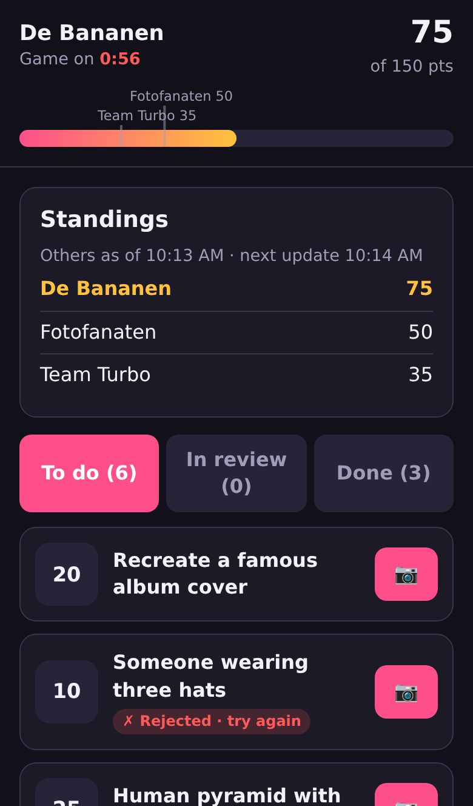
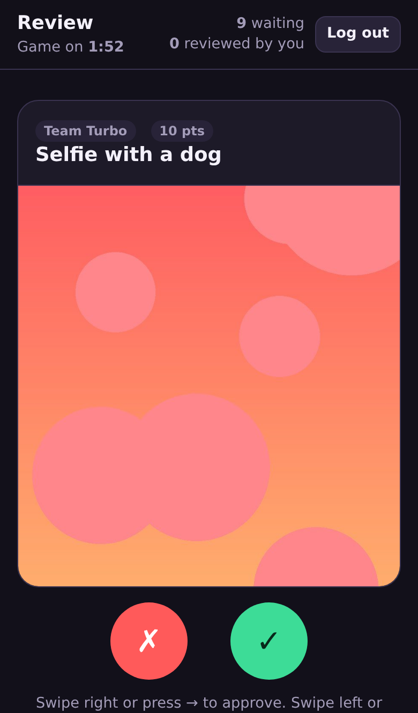
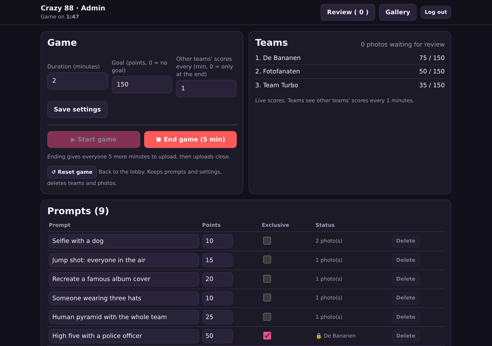
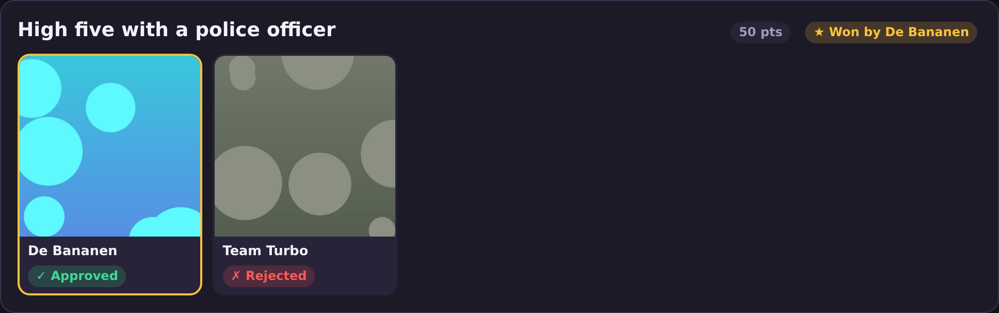

# Crazy 88

A photo scavenger hunt for teams. Teams get a list of prompts, photograph them, and upload from their phone. Reviewers swipe to approve or reject, and approved photos score points. When the game ends, everyone browses all the photos.

It runs in the phone's web browser, so there's nothing to install for players: one phone per team and a code to log in.

<p>
  
  &nbsp;
  
</p>

📄 **[Full guide (PDF)](docs/Crazy88-guide.pdf)**: how to play, how to host, a game-night checklist and troubleshooting.

## How it works

Everyone opens the same address and logs in with a code. There are no accounts.

| Role | Logs in with | Does |
|---|---|---|
| **Team** | Team code + a team name | Sees all prompts, uploads photos, follows its score. Logging in again with the same name rejoins the team. |
| **Reviewer** | Reviewer code | Swipes right to approve, left to reject. Each reviewer gets different photos. |
| **Admin** | Admin code | Manages prompts and settings, starts and ends the game, watches live scores. Can also review. |

**The rules:**
- **Normal prompts:** every team can earn the points, once.
- **Exclusive prompts:** the first approved photo claims the points. Other teams' pending photos for that prompt are rejected automatically, and it locks for everyone else.
- **Retries:** a rejected photo can be retried. While a photo is in review, the team can't upload another for that prompt.
- **Scores:** each team sees its own score live. Other teams' scores are revealed every N minutes, set by the admin (default 5; 0 hides them until the end).
- **Goal:** an optional point goal shows as a progress bar, with markers for the other teams.
- **Ending:** the game ends when the timer runs out. **End game** brings the end forward to 5 minutes from now. After that, uploads close but reviewing continues.
- **Gallery:** at the end, everyone sees every photo per prompt (approved, rejected and pending), with the exclusive winners highlighted.
- **Reset game:** goes back to the lobby for another round. Prompts and settings are kept.





## Hosting

You need a Linux machine with Docker that is online during the game, and HTTPS for the phones. The included setup uses a free [Cloudflare Tunnel](https://developers.cloudflare.com/cloudflare-one/connections/connect-networks/), so no ports need to be opened.

1. In Cloudflare Zero Trust, go to **Networks → Tunnels** and create a tunnel. Copy its token. Add a public hostname (e.g. `crazy88.yourdomain.com`) with service `HTTP` and URL `app:3000`.
2. Get the code and configure it:
   ```bash
   git clone https://github.com/jornvdmaat17/crazy88.git && cd crazy88
   cp deploy/crazy88.env.example .env
   # edit .env: set TEAM_CODE, REVIEWER_CODE, ADMIN_CODE (all different) and TUNNEL_TOKEN
   ```
3. Start it:
   ```bash
   docker compose up -d --build
   ```
4. Open your hostname and log in with the admin code.

The app also listens on `127.0.0.1:8095` on the server itself; change `APP_PORT` in `.env` if that port is taken. Without Cloudflare, drop the `tunnel` service from `docker-compose.yml` and put any HTTPS reverse proxy in front of that port. It must pass WebSockets through and allow uploads of at least 20 MB.

**Data** (an SQLite database plus the photos, about 300 KB each) lives in the `crazy88-data` Docker volume. It survives restarts and updates (`git pull && docker compose up -d --build`).

| Task | Command |
|---|---|
| Save all photos | `docker compose cp app:/data/uploads ./photos` |
| Delete all data, including prompts | `docker compose down -v` |

## Development

```bash
npm install
TEAM_CODE=TEAM REVIEWER_CODE=JUDGE ADMIN_CODE=BOSS npm start   # http://localhost:3000
npm test
```

Built with Node.js, Express, Socket.IO and SQLite (better-sqlite3), with plain HTML/JS on the frontend and no build step. The game rules live in `server/game.js`.

## License

[MIT](LICENSE)
